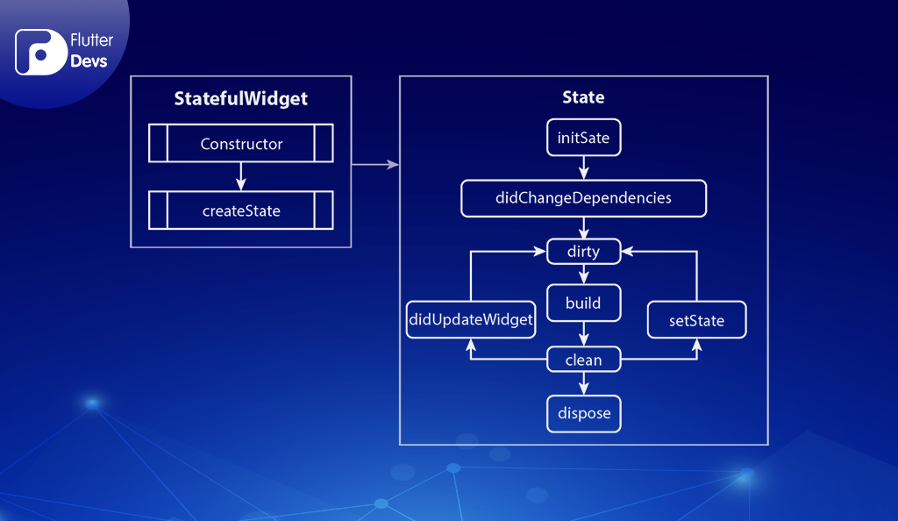

# flutter_todo

A new Flutter project.

## Getting Started

This project is a starting point for a Flutter application.

A few resources to get you started if this is your first Flutter project:

- [Lab: Write your first Flutter app](https://docs.flutter.dev/get-started/codelab)
- [Cookbook: Useful Flutter samples](https://docs.flutter.dev/cookbook)

For help getting started with Flutter development, view the
[online documentation](https://docs.flutter.dev/), which offers tutorials,
samples, guidance on mobile development, and a full API reference.


## Defining terms

Due to the fact that I'm not a "mobile guy" by default, I'm trying to translate myself important terms.

### Splash Screen

The Splash Screen is also called launch screen and provides an experience after starting the application and before you can actually use it. It can be thought of as a kind of beforeMount-hook that is used in mobile applications. In the course of researching for this term I came across the possibility to also initialize relevant parts of the app within this part.

### Stateless vs Stateful Widgets

#### Stateless widgets
Stateless widgets are used to define components that are, usually displayed to the user, without being changed over time. It is an immutable component. Furthermore, stateless widgets cannot change their state during the app's runtime.

#### Stateful widgets 
Stateful widgets are 

Stateful widgets contain a certain set of lifecycle steps.



- `createState()`
- `mounted == true`
- `initState()`
- `didChangeDependencies()`
- `build()`
- `didUpdateWidget()`
- `setState()`
- `deactivate()`
- `dispose()`
- `mounted == false`

### Naming Conventions

Using `_` (underscore) in flutter does include a certain functionality. It represents private methods that are only available within the `.dart` file. Especially for State implementations this is useful, as it can just be instantiated by the corresponding `StatefulWidget`.

```
class MyPage extends StatefulWidget {
  @override
  _MyPageState createState() => _MyPageState();
}

class _MyPageState extends State<MyPage> {
  @override
  Widget build(BuildContext context) {
    return Container();
  }
}
```